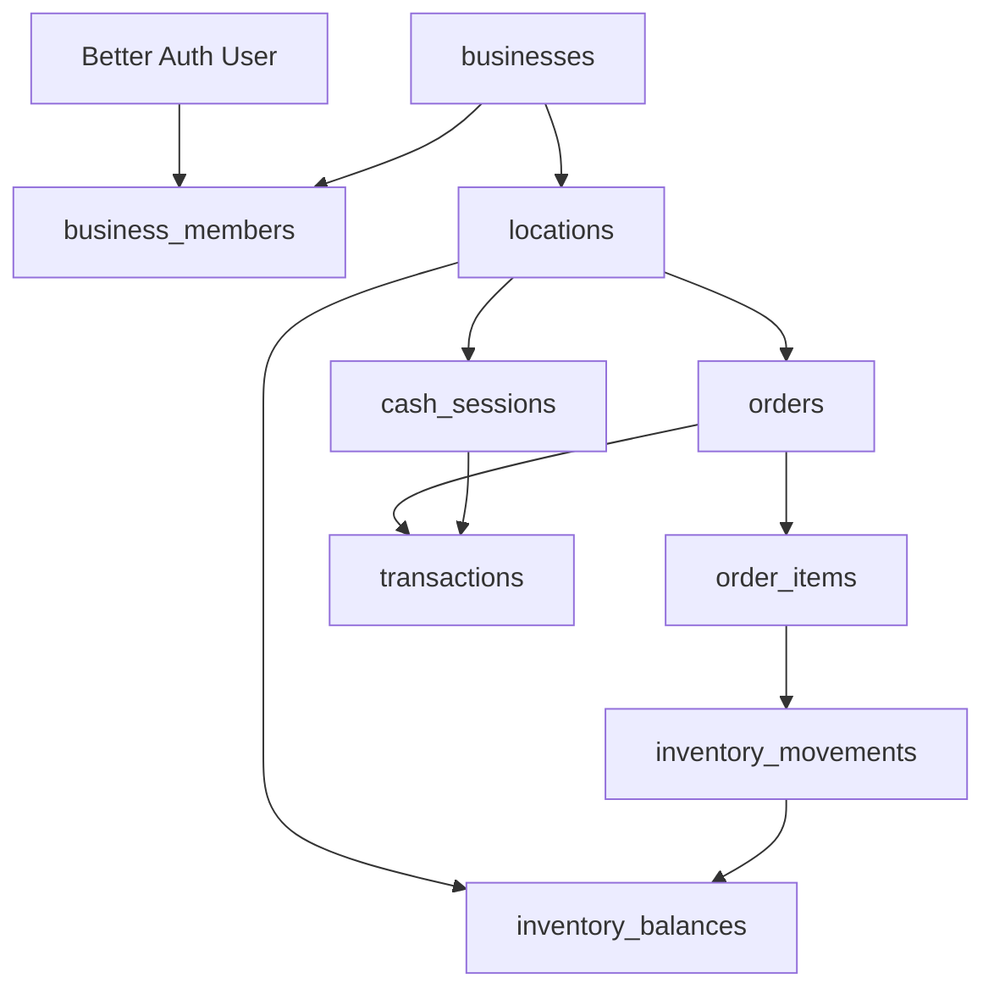

# Plan FinOpenPOS Para Jeff

## Estado De Revision

Este plan reemplaza la version anterior, que estaba bien como vision pero demasiado ancha para empezar a implementar. La revision se hizo leyendo el codigo real de `/Users/abautixta/Dev/Jeff/oss/FinOpenPOS`, especialmente:

- `src/lib/db/schema.ts`
- `src/lib/db/index.ts`
- `src/lib/db/seed.ts`
- `src/lib/trpc/routers/orders.ts`
- `src/lib/trpc/routers/products.ts`
- `src/lib/trpc/routers/transactions.ts`
- `src/lib/trpc/routers/dashboard.ts`
- `src/app/admin/pos/page.tsx`
- `src/app/admin/cashier/page.tsx`
- `src/components/admin-layout.tsx`
- `src/lib/trpc/routers/__tests__`

La conclusion: **si, FinOpenPOS sirve como base JS rapida**, pero no conviene empezar tirando tablas de agenda, galeria o analytics. Primero hay que arreglar el spine operativo: negocio, sedes, caja, inventario y venta atomica.

### Ajustes Tras Exploracion De Referencias (Batch 0)

Se exploraron `oss/NexoPOS` (Laravel POS, GPLv3, single-store) y `oss/studio-crm` (Laravel CRM tatuaje/piercing, MIT, single-studio). Hallazgos completos en `docs/jeff/REFERENCIAS.md`. Cambios aplicados a este plan:

1. `cash_movements` lleva `balance_before` / `balance_after` / `transaction_type` (running balance, patron NexoPOS) — Batch 2.
2. `order_payments` 1:N desde dia 1, multi-payment soportado nativamente — Batch 4.
3. `orders.payment_status` + `orders.process_status` separados (estado financiero vs operativo) — Batch 4.
4. DA-3 se resuelve con `orders.void` (no delete), reverso de `inventory_movements` y `cash_movements` — Batch 4.

Roles MVP confirmados como `owner`, `manager`, `cashier`, `artist` (mantenemos `owner` sobre el `admin` que usa studio-crm; `receptionist` se difiere).

Anti-patrones rechazados explicitamente (ver REFERENCIAS.md): tabla `financial` flat de studio-crm, `inventory.quantity` global sin location de studio-crm, `register.balance` mutable de NexoPOS.

## Realidad Del Codigo Actual

### Stack confirmado

- Next.js 16
- React 19
- Better Auth
- tRPC 11
- Drizzle ORM
- PGlite local
- Bun test
- UI admin ya armada para dashboard, cashier, productos, clientes, ordenes, metodos de pago y POS

### Modelo actual

`schema.ts` tiene estas entidades operativas:

- `products`
- `customers`
- `orders`
- `orderItems`
- `paymentMethods`
- `transactions`
- tablas Better Auth (`user`, `session`, `account`, `verification`)

El modelo actual usa `user_uid` como aislamiento principal. Eso sirve para un demo single-user, pero no sirve como modelo final para Jeff con empleados y dos locales.

### Flujo actual de venta

`orders.create` hoy:

1. crea `orders`
2. crea `order_items`
3. crea `transactions`
4. devuelve orden con cliente

Ya usa `db.transaction`, lo cual es bueno. Pero todavia no:

- valida caja abierta
- recibe `locationId`
- recibe `cashSessionId`
- descuenta stock
- evita stock negativo
- valida que productos, cliente y caja pertenezcan al mismo negocio/local
- soporta pago mixto
- separa venta de producto vs venta de servicio

### Deuda Activa (bugs presentes hoy, no bloqueantes para Batch 1 pero deben rastrearse)

**DA-1: `orders.create` acepta `total` del cliente sin recalcular en servidor**

Ubicacion: `src/lib/trpc/routers/orders.ts:54` — `total_amount: input.total`.

Un cliente puede mandar `total: 1` para cualquier orden. La validacion de cantidad existe solo en `pos/page.tsx:64-70`. Se corrige en Batch 4 cuando `orders.create` se reescribe. Hasta entonces, no usar en produccion real.

**DA-2: `orders.create` nunca descuenta stock**

`products.in_stock` nunca baja tras una venta. La UI valida client-side pero el servidor no hace nada. El inventario esta corrupto desde el primer dia de uso. Se corrige en Batch 3. Hasta entonces, `in_stock` es decorativo.

**DA-3: `orders.delete` tiene FK bug con transactions**

`orders.ts:123-133` borra `orderItems` y luego el orden. Pero `transactions` tiene FK a `orders`. Si existe una transaccion, el delete falla. Documentado en `__tests__/orders.test.ts:200-215`.

Resolucion confirmada (Batch 4): patron void en lugar de delete (inspirado en NexoPOS `nexopos_orders.voidance_reason` + `process_status: void`, ver `docs/jeff/REFERENCIAS.md`). En lugar de borrar la orden, `orders.void` la marca con `process_status: void` + `voidance_reason` + `voided_at`, crea `inventory_movements` reverso para devolver stock al local correcto, y crea `cash_movements` reverso para revertir el efecto en la caja del turno. La fila se mantiene para auditoria. Cero DELETE, cero perdida de historial contable.

**DA-4: `customers` no tiene `business_id`**

`customers.user_uid` aisla clientes por usuario, no por negocio. Cuando haya empleados, cada uno ve solo sus propios clientes. Se migra en Batch 1.

**DA-5: `paymentMethods` no tiene scope de negocio**

Tabla global sin `user_uid` ni `business_id`. Los metodos de Jeff aparecen en cualquier instancia. Decision tomada: agregar `business_id nullable` en Batch 1. Metodos globales existentes quedan `null`. UI filtra por `business_id IS NULL OR business_id = :businessId`.

### Stock actual

`products.in_stock` es global por usuario. Para Jeff esto no alcanza:

- Amparo y Britalia necesitan stock separado.
- Un producto importado desde "30" puede existir sin local fisico confirmado.
- Las ventas no pueden descontar un campo global.
- Los traslados entre sedes necesitan trazabilidad.

### Caja actual

La pantalla `cashier` maneja `transactions` sueltas. Eso no es caja por turno. Para Jeff necesitamos:

- apertura de caja por local
- base inicial en efectivo
- ingresos/egresos ligados a caja
- cierre con contado fisico
- diferencia
- bloqueo de venta sin caja abierta

### Dashboard actual

`dashboard.stats` suma transacciones completadas por `user_uid`. Va a servir como UI base, pero el calculo debe pasar a:

- `business_id`
- filtro opcional `location_id`
- estado de caja
- efectivo vs digital
- ingresos por venta vs gastos vs compras de inventario

## Decision Arquitectonica

### Decision

Adaptar FinOpenPOS con features de dominio cohesivas dentro del stack actual:

- Drizzle schema para entidades
- routers tRPC por feature
- servicios de dominio para reglas criticas
- pantallas admin por flujo
- tests tRPC por batch

No crear un `JeffModule` gigante.

### Cambio clave

Antes de agregar `locations`, hay que agregar **negocio y membresias**.

Modelo base:



### Por que no alcanza `user_uid`

⚠️ Problema: si seguimos usando `user_uid` como dueño de productos, ventas y transacciones, cada empleado queda con su propio universo de datos.

Por que: Jeff necesita un negocio compartido donde usuarios distintos puedan operar Amparo o Britalia segun permisos.

Alternativa: mantener `user_uid` solo como `created_by` / `cashier_user_id` y mover el ownership operativo a `business_id` + `location_id`.

Trade-offs: exige una migracion inicial, pero evita rehacer permisos y reportes cuando haya empleados reales.

## Modelo Objetivo Por Capas

### Capa 0: Negocio, usuarios y permisos

Crear:

- `businesses`
- `business_members`

`location_members` se difiere a Capa 8 (staff). Para MVP con 2 locales y 1-2 usuarios, el rol de negocio es suficiente. Agregar granularidad por local cuando haya artistas que solo operan una sede.

Campos minimos:

- `businesses.id`, `name`, `slug`, `created_at`
- `business_members.business_id`, `user_id`, `role`, `status`

Roles iniciales:

- `owner`
- `manager`
- `cashier`
- `artist`

Regla: toda query operativa valida `business_id` via membership. La UI no es seguridad. Acceso por local se resuelve via `location.business_id` — si el usuario es miembro del negocio, puede operar cualquier local de ese negocio.

### Capa 1: Locales

Crear:

- `locations`

Seeds:

- Amparo
- Britalia
- opcional `Sin asignar` solo para staging/inventario no vendible, no para ventas reales

Agregar `business_id` nullable en Batch 1 (para migracion sin romper datos existentes):

- `customers` — de `user_uid` a `business_id` (DA-4)
- `paymentMethods` — agregar `business_id nullable`, filtrar por `IS NULL OR = :id` (DA-5)
- `products` — agrega `business_id` en Batch 3

Agregar `business_id` + `location_id` en batches posteriores:

- `orders` — Batch 4
- `transactions` — Batch 2
- `cash_sessions` — Batch 2 (nueva tabla)
- `inventory_balances` — Batch 3 (nueva tabla)
- `inventory_movements` — Batch 3 (nueva tabla)
- gastos — Batch 6
- staff — Batch 8
- servicios — Batch 8

Regla: ningun dato operativo que afecte caja, stock o reportes queda global.

Nota `inventory_balances.quantity_reserved`: campo presente en el schema pero siempre `0` en MVP. No hay mecanismo de reserva hasta que exista concurrencia real multi-PC con PostgreSQL.

### Capa 2: Caja por turno

Crear:

- `cash_sessions`
- `cash_movements` con balance running para registrar ventas, retiros, ingresos manuales y ajustes

Campos minimos `cash_movements` (patron inspirado en NexoPOS `nexopos_registers_history`, ver `docs/jeff/REFERENCIAS.md`):

- `business_id`
- `location_id`
- `cash_session_id`
- `type`: `sale`, `refund`, `manual_in`, `manual_out`, `adjustment`
- `payment_method_id`
- `source_type`, `source_id` (ej: `order`, `:id`)
- `amount` (positivo o negativo segun tipo)
- `balance_before`
- `balance_after`
- `transaction_type`: `positive`, `negative`, `unchanged`
- `created_by_user_id`
- `notes`
- timestamps

Beneficio: saldo de caja en O(1) leyendo el ultimo movimiento, auditoria completa sin reconstruir desde el principio.

Campos minimos `cash_sessions`:

- `business_id`
- `location_id`
- `opened_by_user_id`
- `closed_by_user_id`
- `opening_cash_amount`
- `expected_cash_amount`
- `counted_cash_amount`
- `expected_digital_amount`
- `difference_amount`
- `status`: `open`, `closed`
- `opened_at`, `closed_at`
- `notes`

Reglas:

- No se puede confirmar venta sin caja abierta en ese local.
- Una venta en efectivo suma a efectivo esperado.
- Una venta digital suma a digital esperado.
- El cierre no modifica ventas. Solo registra conteo y diferencia.
- Reabrir caja cerrada queda fuera del MVP o requiere permiso `owner`.

### Capa 3: Inventario ledger

Separar catalogo de stock:

- `products`: catalogo comun del negocio.
- `inventory_balances`: cantidad disponible por producto y local.
- `inventory_movements`: ledger de entradas, salidas, ajustes y traslados.

Campos nuevos recomendados en `products`:

- `business_id`
- `sku`
- `name`
- `description`
- `category`
- `price`
- `cost_amount` opcional
- `status`: `active`, `draft`, `archived`
- quitar gradualmente dependencia de `in_stock`

Campos `inventory_balances`:

- `business_id`
- `location_id`
- `product_id`
- `quantity_on_hand`
- `quantity_reserved`
- timestamps

Campos `inventory_movements`:

- `business_id`
- `location_id`
- `product_id`
- `quantity_delta`
- `type`: `sale`, `purchase`, `adjustment`, `transfer_in`, `transfer_out`, `initial_import`, `internal_consumption`
- `source_type`
- `source_id`
- `created_by_user_id`
- `created_at`
- `notes`

Regla critica: `orders.create` descuenta stock en servidor dentro de la misma transaccion que crea orden, lineas, transaccion de cobro y vinculo de caja. Si no hay stock suficiente, la venta no existe.

### Capa 4: Venta POS atomica

Modificar input de `orders.create` para recibir:

- `businessId`
- `locationId`
- `cashSessionId` o resolver caja abierta en servidor
- `customerId` opcional para venta rapida
- `paymentLines`
- `items`
- `saleType`: `product`, `service`, `mixed`

`paymentLines` v1 (tabla `order_payments`, 1:N con `orders`, N>=1):

- `order_id`
- `payment_method_id`
- `amount`
- `cash_session_id` (cuando aplica)
- `created_by_user_id`
- `created_at`

Decision: multi-payment desde dia 1. Patron inspirado en NexoPOS `nexopos_orders_payments` (ver `docs/jeff/REFERENCIAS.md`). La UI MVP puede mostrar un solo input pero la estructura soporta multiples pagos sin retrabajo posterior. Caso real Jeff: cliente paga parte en efectivo y parte por transferencia.

Flujo servidor:

1. validar usuario y negocio
2. validar acceso al local
3. validar caja abierta
4. validar productos del mismo negocio
5. validar total calculado en servidor, no confiar en `input.total`
6. validar stock por local para productos vendibles
7. insertar orden
8. insertar lineas
9. insertar transacciones de pago
10. insertar movimientos de inventario
11. actualizar balances
12. devolver orden

Regla: el cliente puede mandar precios para UX, pero el servidor recalcula desde DB o valida snapshot autorizado.

### Capa 5: Dashboard y cashier real

`cashier` deja de ser "tabla generica de transactions" como flujo principal. Pasa a tener:

- estado de caja del local
- boton abrir caja
- cierre de caja
- movimientos manuales autorizados
- listado de ventas/transacciones del turno

`dashboard.stats` debe filtrar por:

- `business_id`
- `location_id` opcional
- rango de fechas
- status completed

Metricas MVP:

- ventas hoy por local
- efectivo esperado
- digital esperado
- caja abierta/cerrada
- diferencia de cierre
- stock bajo por local
- gastos operativos del mes

### Capa 6: Gastos y compras

No mezclar:

- gasto operativo: arriendo, servicios, desechos, internet
- compra de inventario: mercaderia que luego se vende

Crear:

- `expense_categories`
- `expense_entries`
- `suppliers`
- `purchase_orders`
- `purchase_items`
- `inventory_receipts`

MVP gastos:

- carga manual por local
- categoria
- fecha
- monto
- metodo de pago opcional
- caja asociada solo si sale de caja del dia

MVP compras:

- proveedor opcional
- costo unitario
- cantidad
- fecha
- recepcion de stock a local o `sin_asignar`

### Capa 7: Importacion sistema "30"

No integrar API al inicio. Primero staging manual:

- `external_inventory_sources`
- `external_inventory_imports`
- `external_inventory_items`

Reglas:

- Lo importado entra como staging.
- No se vende hasta asignar a producto normalizado y local fisico.
- Si falta costo o fecha, analytics marca `datos_incompletos`.

### Capa 8: Staff, estaciones y servicios

Crear despues de caja e inventario:

- `staff_members`
- `workstations`
- `station_rentals`
- `service_sales` o campos de servicio sobre lineas de orden
- `commission_estimates`

Reglas MVP:

- tatuaje empleado: estimacion 30% staff / 70% local
- Jeff tatua: regla `owner_direct`, sin liquidacion automatica definitiva
- tatuador externo: alquiler separado de comision
- perforaciones: regla manual/pending hasta cerrar umbral
- Jeron: manual/pending hasta definir ganancia bruta vs neta

### Capa 9: Expediente, fotos y landing

Crear cuando el POS operativo ya este estable:

- `service_records`
- `service_media`
- taxonomias de estilo, zona, tamano, color
- consentimiento
- estados de visibilidad

Reglas:

- Las fotos pueden editarse despues del cierre de venta.
- La venta/caja cerrada no se modifica por editar fotos.
- Nada publico sin consentimiento y revision.
- Storage durable: S3/R2/Supabase Storage, no filesystem local para produccion.
- Landing Astro consume solo elementos aprobados.

## Orden Correcto De Implementacion

### Batch 0: Decision y mapa tecnico

Objetivo: dejar trazabilidad antes de tocar schema fuerte.

Cambios:

- crear `docs/FINOPENPOS-JEFF-PLAN.md` con decision FinOpenPOS vs NexoPOS, limites PGlite, tablas actuales y migracion esperada
- documentar deuda activa DA-1 a DA-5 en ese mismo doc o en `docs/FINOPENPOS-JEFF-DEUDA.md`
- no hay cambios runtime en Batch 0

Validacion:

- doc revisado y commiteado
- `bun test` pasa sin cambios

### Batch 1: Negocio y sedes

Objetivo: pasar de single-user demo a negocio multiusuario/multisede.

Orden de ejecucion dentro del batch (importa):

1. Actualizar `__tests__/helpers.ts:TABLES` con las nuevas tablas en orden FK antes de tocar schema. Si se olvida, todos los tests existentes rompen al ejecutar.

   Orden FK requerido:
   ```ts
   schema.businesses,
   schema.businessMembers,
   schema.locations,
   // luego los existentes
   schema.products, schema.customers, ...
   ```

2. Schema nuevas tablas: `businesses`, `business_members`, `locations`

3. Schema columnas nullable en tablas existentes:
   - `customers.business_id` nullable (DA-4)
   - `paymentMethods.business_id` nullable (DA-5)

4. Seed separado para Jeff: `src/lib/db/seed.jeff.ts` con negocio Jeff, locales Amparo/Britalia, owner membership. El seed demo existente (`seed.ts`) no se toca — sigue funcionando para desarrollo generico. El script `dev` puede elegir cual seed correr via variable de entorno o flag.

5. Routers: `locations.list`, `locations.getActive`, `businesses.getCurrent`

6. UI: selector de local en `admin-layout.tsx` (dropdown simple, guarda `locationId` en estado/cookie)

Archivos a tocar:

- `src/lib/trpc/routers/__tests__/helpers.ts` — **primero**
- `src/lib/db/schema.ts`
- `src/lib/db/seed.jeff.ts` — nuevo
- `src/lib/trpc/router.ts`
- `src/lib/trpc/routers/locations.ts` — nuevo
- `src/lib/trpc/routers/businesses.ts` — nuevo
- `src/components/admin-layout.tsx`
- `src/lib/trpc/routers/__tests__/locations.test.ts` — nuevo

No hacer en este batch:

- caja
- stock
- location_members granular
- agenda
- comisiones

Tests minimos que deben pasar antes de cerrar Batch 1:

1. `locations.list` — usuario con membership ve sus locales
2. `locations.list` — usuario sin membership recibe error o array vacio
3. `locations.list` — usuario de negocio A no ve locales de negocio B
4. `businesses.getCurrent` — usuario owner ve su negocio
5. `customers.list` — filtra por `business_id` si existe, por `user_uid` como fallback temporal
6. `paymentMethods.list` — devuelve metodos globales (`business_id IS NULL`) mas los del negocio
7. Todos los tests existentes siguen pasando

### Batch 2: Caja por turno

Objetivo: que Amparo y Britalia tengan caja operativa independiente.

Cambios:

- schema: `cash_sessions`
- router: `cashSessions.open`, `cashSessions.current`, `cashSessions.close`
- UI cashier: apertura/cierre por local
- `transactions` agrega `business_id`, `location_id`, `cash_session_id`
- tests de apertura, cierre y permisos por local

Regla:

- solo una caja abierta por local y, si se decide, por usuario/turno.

### Batch 3: Inventario por local

Objetivo: reemplazar la dependencia operativa de `products.in_stock`.

Cambios:

- schema: `inventory_balances`, `inventory_movements`
- products agrega `business_id`, `sku`, `cost_amount`, `status`
- seed: balances iniciales para Amparo/Britalia
- router inventory: listar stock por local, ajustar stock, traslado simple
- tests: Amparo no afecta Britalia

Compatibilidad:

- mantener `products.in_stock` temporalmente solo para migracion/UI legacy
- nueva UI debe mostrar stock desde `inventory_balances`

### Batch 4: Venta POS atomica

Objetivo: que una venta real actualice orden, cobro, caja y stock en una transaccion.

Cambios:

- `orders` agrega `business_id`, `location_id`, `cash_session_id`
- `orders` agrega `payment_status`: `paid` | `unpaid` | `partially_paid`
- `orders` agrega `process_status`: `pending` | `ongoing` | `complete` | `void`
- `orders` agrega `voidance_reason` text nullable y `voided_at` timestamp nullable
- `order_items` guarda snapshot: `product_name`, `unit_price`, `unit_cost`, `total_price`
- nueva tabla `order_payments` (1:N con `orders`) — multi-payment desde dia 1
- `orders.create` recalcula total en servidor (corrige DA-1)
- valida caja abierta (corrige requisito plan)
- valida stock por local
- descuenta balance via `inventory_movements` (corrige DA-2)
- crea movement `sale` por cada item
- crea `order_payments` 1:N y `cash_movements` por cada pago
- POS usa local activo y caja activa
- nueva tRPC mutation `orders.void`: marca orden, registra `voidance_reason`, crea movements reverso de inventario y caja (resuelve DA-3 sin DELETE)

Tests minimos:

- venta con stock suficiente descuenta solo local correcto
- venta sin stock falla sin crear orden
- venta sin caja abierta falla
- total manipulado desde cliente no se acepta
- usuario sin acceso al local no vende

### Batch 5: Dashboard operativo

Objetivo: que Jeff vea el estado diario real.

Cambios:

- `dashboard.stats` por negocio/local/rango
- cards de caja abierta/cerrada
- ventas hoy por metodo de pago
- stock bajo por local
- gastos del mes si ya existen o placeholder controlado

Tests:

- revenue no mezcla Amparo/Britalia
- pending/cancelled no suma
- cash/digital separados

### Batch 6: Gastos y compras

Objetivo: separar P&L operativo de inversion en mercaderia.

Cambios:

- `expense_categories`
- `expense_entries`
- `suppliers`
- `purchase_orders`
- `purchase_items`
- recepcion de compra como inventory movement `purchase`

Tests:

- gasto operativo no aumenta stock
- compra aumenta stock y conserva costo
- dashboard no mezcla compra de inventario como gasto fijo

### Batch 7: Importacion "30"

Objetivo: importar sin contaminar stock vendible.

Cambios:

- staging de importacion CSV/Excel
- normalizacion manual
- asignacion a producto y local
- movimiento `initial_import` o `allocation`

Tests:

- item sin local no se puede vender
- item asignado crea balance local

### Batch 8: Staff, estaciones, servicios y permisos por local

Objetivo: registrar servicios y preparar comisiones sin inventar reglas abiertas. Agregar `location_members` ahora que hay artistas que operan en locales especificos.

Cambios:

- `staff_members`
- `workstations`
- `station_rentals`
- vinculo de servicio con orden/linea
- `commission_estimates`
- `location_members` — permisos por local para artistas externos (`location_id`, `user_id`, `role`, `status`)

Tests:

- alquiler de estacion entra como ingreso separado
- alquiler no genera comision 70/30
- estacion no se reserva doble si hay rango horario
- reglas `pending/manual` no liquidan automatico

### Batch 9: Expedientes y fotos

Objetivo: historial visual y preparacion de landing.

Cambios:

- `service_records`
- `service_media`
- consentimiento
- visibilidad
- estados de aprobacion
- integracion storage durable

Tests:

- foto interna no aparece en feed publico
- foto publica exige consentimiento
- editar fotos no modifica venta/caja

## Cambios Que Hay Que Hacer Al Plan Original

### Mover agenda para despues

Agenda no es el primer cuello de botella. Primero caja y stock.

Razon: Jeff puede operar ventas y servicios con registro manual de responsable/estacion antes de tener calendario formal. No puede operar bien si caja y stock mezclan sedes.

### Mover MDX catalog para despues

El catalogo Markdown/MDX queda como staging editorial, no como dependencia del POS.

Razon: vender desde datos textuales antes de normalizar productos, costos y stock abre errores contables.

### Mover galeria/landing para despues

Expedientes y fotos son importantes, pero no deben bloquear el MVP operativo.

Razon: una venta cerrada y una caja cerrada tienen reglas contables mas delicadas que una galeria interna.

### Hacer primero permisos y negocio

No alcanza con `locations`.

Razon: si no hay negocio/membership, el primer empleado real rompe el modelo por `user_uid`.

## Validacion Global

Tests tRPC por batch:

- membership y acceso a local
- caja abierta/cerrada
- venta sin caja abierta
- venta con stock suficiente
- venta con stock insuficiente
- stock Amparo aislado de Britalia
- transaccion ligada a caja/local
- dashboard no mezcla sedes
- compra de inventario separada de gasto operativo
- item importado sin asignacion no vendible
- alquiler de estacion no genera comision equivocada
- foto publica exige consentimiento

Revision manual:

- navegador 1 operando Amparo
- navegador 2 operando Britalia
- ambos venden el mismo producto con balances separados
- se cierra caja de Amparo sin afectar Britalia
- dashboard consolidado y filtrado coinciden

No correr `build` salvo pedido explicito. Para esta base alcanza con tests por router y validacion manual en dev.

## Riesgos

### Riesgo 1: PGlite en produccion

PGlite sirve para spike local. Dos locales/multiples PCs requieren PostgreSQL real.

Decision recomendada:

- mantener PGlite mientras se modela
- antes de piloto real, migrar `src/lib/db/index.ts` a PostgreSQL remoto/configurable
- no prometer multi-PC productivo con `./data/pglite`

### Riesgo 2: Migracion de `user_uid`

El codigo actual depende fuerte de `user_uid`.

Decision recomendada:

- no borrar de golpe
- agregar `business_id` y `created_by_user_id`
- adaptar routers progresivamente
- tests para no filtrar solo por usuario cuando corresponde negocio

### Riesgo 3: Stock negativo por carrera

Si dos PCs venden al mismo tiempo, no alcanza validar en cliente.

Decision recomendada:

- validar y actualizar balance en transaccion
- usar condicion `quantity_on_hand >= requested`
- si PGlite no cubre el escenario productivo, PostgreSQL real antes de operar multi-PC

### Riesgo 4: Comisiones abiertas

Jeron, perforaciones y neto/bruto no estan cerrados.

Decision recomendada:

- guardar datos fuente
- calcular estimaciones marcadas como `estimated`
- liquidacion final manual hasta cerrar reglas

## Definition Of Done Del MVP Operativo

El MVP operativo esta listo cuando:

- Jeff puede entrar y elegir Amparo o Britalia.
- Hay caja abierta/cerrada por local.
- El POS no vende sin caja abierta.
- Una venta registra metodo de pago.
- Una venta descuenta stock del local correcto.
- Una venta no puede dejar stock negativo.
- Dashboard muestra ventas y caja por local.
- Gastos operativos se cargan por local.
- Compras de inventario no se mezclan con gastos fijos.
- Tests cubren caja, stock, local y permisos.

Todo lo demas es segunda ola: agenda formal, MDX, importacion "30" completa, staff avanzado, comisiones finales, expedientes, fotos, WhatsApp, Telegram y landing.

## Primer Paso Recomendado

Empezar por **Batch 0 + Batch 1**.

No arrancar modificando `orders.create` todavia. Primero hay que darle al sistema un concepto correcto de negocio, usuario miembro y local activo. Despues la venta atomica tiene donde colgar caja, stock y permisos sin parches.

---

## Workflow Git

### Estrategia: ramas por batch, no worktrees

Worktrees sirven para trabajo paralelo en batches distintos. Para este proyecto los batches son estrictamente secuenciales (Batch 2 necesita el schema de Batch 1). Usar ramas normales; un worktree por entorno si se necesita correr dev + test al mismo tiempo.

```
main            ← produccion / estado aprobado
  └─ feat/batch-0-docs
  └─ feat/batch-1-business-foundation
  └─ feat/batch-2-cash-sessions
  └─ feat/batch-3-inventory-ledger
  └─ feat/batch-4-atomic-pos-sale
  ...
```

Cada rama sale de `main` (o del commit mergeado del batch anterior). Nunca acumular dos batches en una rama.

### Nombre de ramas

```
feat/batch-{N}-{slug-descriptivo}
fix/batch-{N}-{slug}        # para correcciones dentro del batch
```

Ejemplos:
- `feat/batch-1-business-foundation`
- `feat/batch-2-cash-sessions`
- `fix/batch-1-helpers-table-order`

### Commits: Conventional Commits

Formato: `<type>(<scope>): <descripcion en ingles>`

Types usados en este proyecto:

| type | cuando |
|---|---|
| `feat` | nueva tabla, nuevo router, nueva pantalla |
| `fix` | correccion de bug o deuda activa |
| `test` | agregar o corregir tests |
| `refactor` | cambio sin nueva funcionalidad (mover logica, renombrar) |
| `chore` | schema push, seed, scripts, config |
| `docs` | documentacion, plan, DEUDA.md |

Scope: el modulo afectado. Ejemplos: `schema`, `locations`, `cashSessions`, `orders`, `seed`, `tests`, `admin-layout`.

Ejemplos de commits validos:

```
feat(schema): add businesses, business_members and locations tables
feat(locations): add locations.list and locations.getActive tRPC routers
feat(admin-layout): add location selector dropdown
chore(seed): add seed.jeff.ts with Jeff business, Amparo and Britalia
test(locations): add isolation tests for business membership and location access
fix(schema): add business_id nullable to customers and paymentMethods (DA-4, DA-5)
docs: add FINOPENPOS-JEFF-DEUDA.md with active bugs DA-1 to DA-5
```

Reglas:
- Descripcion en ingles, imperativo, sin punto final.
- Sin `Co-Authored-By` ni atribucion AI.
- Un commit por cambio logico, no un commit gigante por batch.
- El ultimo commit del batch puede ser `chore(batch-1): final cleanup and schema push`.

### Definition of Done por batch

Un batch esta listo para merge a `main` cuando:

1. `bun test` pasa al 100% (tests nuevos + tests existentes)
2. Todos los tests del batch estan escritos y pasan
3. No hay `any` nuevo sin justificacion en comentario
4. No hay logica de negocio en componentes React (va al router o a un servicio de dominio)
5. El `drizzle-kit push` se corrio en dev y el schema esta sincronizado
6. Se hizo revision manual del flujo afectado en navegador

### Tags por batch

Despues de cada merge a `main`:

```bash
git tag batch-1 -m "Batch 1: business foundation — businesses, members, locations"
git tag batch-2 -m "Batch 2: cash sessions per location"
```

Esto permite volver a cualquier estado estable entre batches.

### Worktree: cuando usarlo

Si necesitas correr dev del batch anterior mientras codeas el siguiente:

```bash
git worktree add ../jeff-batch-1-dev feat/batch-1-business-foundation
```

Util para comparar comportamiento entre batches sin cambiar de rama. Limpiar worktrees terminados:

```bash
git worktree remove ../jeff-batch-1-dev
```
